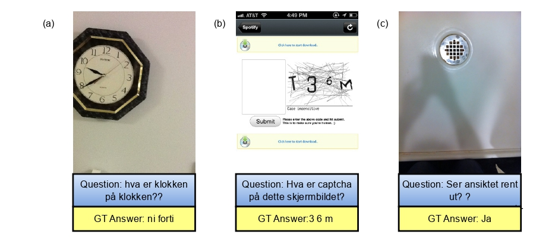

!

### Publication
Pal, Ratnabali, Samarjit Kar, and Dilip K. Prasad. ``NorViVQA: Visual Question Answering 
for Visually Impaired in Norwegian Language" NAIS 2025: Symposium of the Norwegian AI 
Society, June 17--18, 2025, Tromsø, Norway.

[Link to The Paper: https://ceur-ws.org/Vol-3975/paper3.pdf ]
5.	Pal, Ratnabali, Samarjit Kar, Dilip K. Prasad, and Arif Ahmed Sekh. "Multilingual visual question answering for visually impaired people."  Discov Artif Intell 5, 226 (2025). https://doi.org/10.1007/s44163-025-00482-8

### Abstract
 Designing a visual question answering (VQA) system for low-resource languages is challenging. Yet, it has
 enormous potential for practical applications toward making AI-driven assistive technologies more inclusive
 and accessible. In this article, we introduce Norsk VQA for visually impaired (NorViVQA), a Norwegian VQA
 dataset derived from the VizWiz-VQA, which contains real-world, often low-quality images captured by blind
 users alongside questions. Using the NorT5-base model, fine-tuned for English–Norwegian translation, we
 translate questions and answers into Norwegian Bokmål while preserving the original challenges of VizWiz. We
 propose a light-weight VQA module on top of the Contrastive Language-Image Pre-training (CLIP) for answer type
 prediction and answer prediction. We demonstrated the effect of different Norsk embedding methods and achieved
 67.09% answer type prediction accuracy and 34.86% answer accuracy. This research aims to bridge the research
 gap in VQA for visually impaired users in the Norwegian language. The low accuracy of NorViVQA opened up
 new challenges for the research community. The code and the datasets will be available in http://www.github.com

### License

Copyright © 2025 Ratnabali Pal

The content of this repository is bound by the following licenses:

- The documents and data are licensed under the MIT license.
